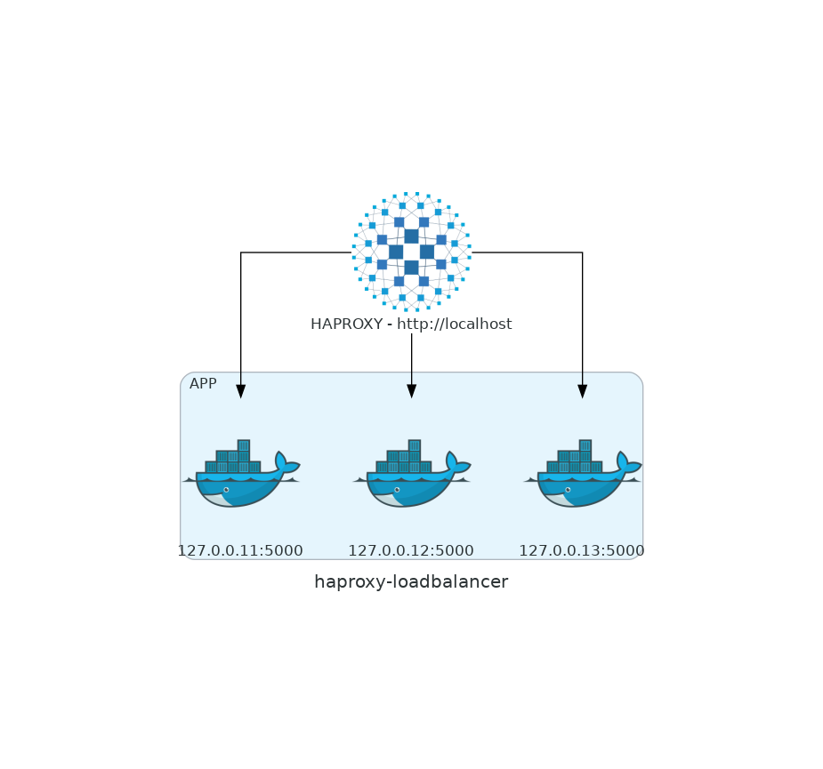

# HAPROXY - Alura mais

- Definir os 2 serviços docker e a instalação do HAPROXY no servidor
- Configurar os tipos de load-balance para roundrobin e weight
- Visualizar o load com instâncias rodando e não rodando

### Referências:

- Site oficial - [Link](http://www.haproxy.org/)

- Diagrama:



- Procedimento:

1. Criar uma VM para testes (Você pode usar sua própria máquina) com Linux.
2. Instalar o docker: 
```sh 
    $ sudo su -
    apt-get install curl
    curl -fsSL https://get.docker.com | sh
    docker ps -a
```
3. Subir 3 webservers na mesma porta com o docker:
```sh
    docker run -d -p 127.0.0.11:5000:80 --name node1 httpd
    docker run -d -p 127.0.0.12:5000:80 --name node2 httpd
    docker run -d -p 127.0.0.13:5000:80 --name node3 httpd
    docker ps
```
4. Instalar o haproxy:
```sh
    apt-get install haproxy -y
```
5. Editar o arquivo de conf do proxy para fazer o balanceamento por roundrobin:
```sh
    vi /etc/haproxy/haproxy.cfg
```

<pre>
#---------------------------------------------------------------------
# main frontend which proxys to the backends
#---------------------------------------------------------------------
frontend main
    bind *:80
    stats uri /haproxy?stats
    acl url_static       path_beg       -i /static /images /javascript /stylesheets
    acl url_static       path_end       -i .jpg .gif .png .css .js

    #use_backend static          if url_static
    default_backend             app

#---------------------------------------------------------------------
# static backend for serving up images, stylesheets and such
#---------------------------------------------------------------------
#backend static
#    balance     roundrobin
#    server      static 127.0.0.1:81 check

#---------------------------------------------------------------------
# round robin balancing between the various backends
#---------------------------------------------------------------------
backend app
    #balance     roundrobin
    server  app1 127.0.0.11:5000 check
    server  app2 127.0.0.12:5000 check
    server  app3 127.0.0.13:5000 check
</pre>
    
```sh
    service haproxy restart
```

6. Sobrecarregar de requests: 

```sh
    for i in {1..1000};do printf "Request # %5s -> Response: " $i; curl -s -o /dev/null -w "%{http_code}" http://192.168.1.121; echo;done
```

7. Acessar : `http://<IP>/haproxy?stats`

8. Derrubar um node para ver como o LB se comporta e rodar os requests novamente:

```sh
    docker stop node1
```

9. Mudar o algoritmo para weight, para demonstrar como mandar trafego a mais para um dos nos:

<pre>
    server  app1 127.0.0.11:5000 weight 20 check
    server  app2 127.0.0.12:5000 weight 10 check
    server  app3 127.0.0.13:5000 weight 5  check
</pre>

